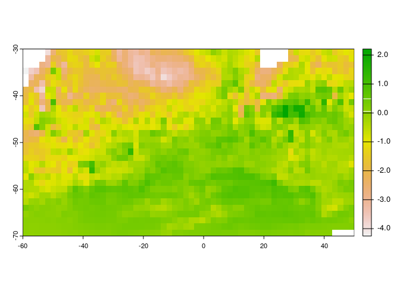

<!-- README.md is generated from README.Rmd. Please edit that file -->

# fl

<!-- badges: start -->
<!-- badges: end -->

The goal of fl is to …

## Installation

You can install the development version of fl like so:

``` r
# FILL THIS IN! HOW CAN PEOPLE INSTALL YOUR DEV PACKAGE?
```

## Example

The idea is that we obtain data sources for gdal that don’t require any
logic in R functions.

In this case, the OISST files are augmented as VRT. We need

- declare the driver and the subdataset (we get NETCDF:<filename>:sst in
  this case)
- fill in the missing crs metadata (we need a full VRT expansion)

In GDAL 3.7.0 we don’t need vrt expansion, we would use

    vrt://NETCDF:<filename>:sst?a_srs=OGC:CRS83

but for now, need some tricks here to keep the VRT generation fast (by
templating) and small-ish (by removing metadata).

Then we have data source strings ready for the warper! Here we get a
source for every month, and write to a GeoTIFF for each, using average
resampling (the data are aggregated to 2.5 cells from 0.25). We can
cross the dateline or the prime meridian, it doens’t matter because the
warper sorts that out.

``` r
library(fl)
#> global option 'raadfiles.data.roots' set:
#> '/rdsi/PRIVATE/raad/data               
#>  /rdsi/PRIVATE/raad/data_local         
#>  /rdsi/PRIVATE/raad/data_staging       
#>  /rdsi/PRIVATE/raad/data_deprecated    
#>  /rdsi/PUBLIC/raad/data                '
#> Uploading raad file cache as at 2023-05-08 20:15:51 (1211638 files listed)
files <- oisst_daily_sst_files(seq(as.Date("1992-03-21"), by = "1 month", length.out = 12L * 580))
#> Warning in raad_dedupe(findex, qdate, removeDupes = TRUE): duplicated dates
#> will be dropped
#> Warning in raad_match_files(date, fdate[findex], findex, daytest =
#> switch(timeres, : 1 input dates have no corresponding data file within 1.500000
#> days of available files
#files <- oisst_daily_sst_files()


## we can get a mean
ext <- c(-60, 50, -70, -30)
dm <- c(60, 30)
#mn <- vapour::gdal_raster_data(files$datasource, target_dim = dm, target_ext = ext)
## or vectorize over sources
#bands <- lapply(files$datasource, vapour::gdal_raster_data, target_dim = dm, target_ext = ext)

library(furrr)
#> Loading required package: future
options(parallelly.fork.enable = TRUE, future.rng.onMisuse = "ignore")
plan(multicore)
func <- function(.x) vapour::gdal_raster_dsn(.x, target_dim = dm, target_ext = ext, resample = "average")[[1]]

## or write to file
system.time({
flist <- future_map_chr(files$datasource, func) 
})
#>    user  system elapsed 
#>  12.538   5.051   9.374
plan(sequential)

str(basename(flist))
#>  chr [1:374] "file95a95770715d0.tif" "file95a95234ce4d6.tif" ...
# chr [1:374] "file90aa0142157a4.tif" "file90aa0453395b2.tif" "file90aa04bd28a87.tif" "file90aa05fb4b65d.tif" ...
```

On 32 cores that takes 27 seconds, 374 input files.

For the entire series, 15216 files it takes 162 seconds.

Just to see what we get.

``` r
library(terra)
#> terra 1.7.23
r <- rast(flist[seq(1, length(flist), length.out = 374)])
mn <- mean(r)
plot(mn - rast(sample(flist, 1)))
```



The data natively are in 0,360 - we can target any grid we want from
this improved source collection.
